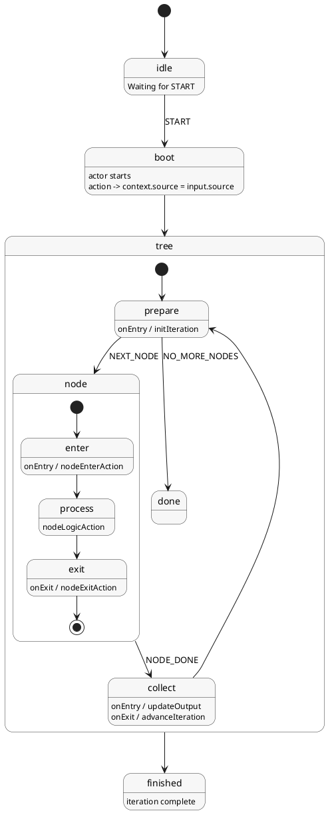

# Rearticulated Requirement

You want an **XState machine using `setup().createMachine()` and actors** that demonstrates a **recursive deep iteration over a tree structure**, where recursion is **modeled entirely through states**, not through function calls.

The purpose is to manage traversal, transformation, and aggregation **without ever exposing or relying on depth, level, or node position**.

---

## Global Constraints

* **No TypeScript types** (no interfaces, no generics, no explicit typing).

* Must strictly follow the provided **machine pattern**:

  ```ts
  setup({ ... }).createMachine({ ... })
  ```

* All behavior must be implemented via:

    * states
    * actions
    * actors
    * transitions

* **No inline logic inside states**; all logic lives in actions.

---

## Context Contract

The machine context must contain and behave as follows:

### 1. `context.source`

* Receives its value **only from `input.source`**.
* When an actor starts, it must execute:

  ```
  context.source = input.source
  ```

### 2. `context.transform`

* A transient structure that:

    * tracks iteration progress,
    * stores traversal state,
    * determines the next node to process.
* Updated **only via actions**.
* Must not expose:

    * depth,
    * level,
    * index,
    * parent/child relationships externally.

### 3. `context.output`

* Accumulates results **incrementally**.
* Updated only when a node finishes processing.
* Never computed in bulk.

---

## State Responsibilities

### TreeNode State (Single Node Lifecycle)

* Represents processing of **one node**.
* Responsibilities:

    * **onEntry**: initialize or update `context.transform` for the current node.
    * **during**: execute node-specific logic via actions.
    * **onExit**: finalize node processing.
* Must **not**:

    * update `context.output`,
    * know its depth, position, or parent.

---

### Tree State (Iteration Orchestrator)

* Controls traversal flow.
* Responsibilities:

    * **onEntry**:

        * decide which node to process next,
        * route execution to TreeNode.
    * **onExit**:

        * aggregate node results into `context.output`,
        * advance iteration pointers in `context.transform`,
        * schedule the next iteration.

This state is the **only place** where:

* completion is detected,
* next iteration is triggered,
* output aggregation happens.

---

## Actor Usage

* Actors are used to:

    * bootstrap iteration,
    * inject `input.source` into context,
    * trigger traversal cycles.
* Actors must **not**:

    * contain traversal logic,
    * manage recursion.

---

## Separation of Concerns

* **Actions**: all logic and mutations.
* **States**: lifecycle boundaries only.
* **Actors**: signaling and bootstrapping only.

---

## Expected Behavior

The final machine must:

* Traverse arbitrarily deep structures.
* Be fully state-driven and resumable.
* Produce incremental output.
* Never expose traversal depth or position.
* Remain deterministic and declarative.

---

## State Machine Diagram (PlantUML)




# XState Machine Code

```ts

import { setup, assign, fromCallback } from "xstate"

/**
 * ─────────────────────────────────────────────────────────────
 * EXAMPLE INPUT (input.source)
 *
 * {
 *   id: "node-0",
 *   value: "A",
 *   children: [
 *     {
 *       id: "node-0-0",
 *       value: "B",
 *       children: [
 *         {
 *           id: "node-0-0-0",
 *           value: "D"
 *         }
 *       ]
 *     },
 *     {
 *       id: "node-0-1",
 *       value: "C"
 *     }
 *   ]
 * }
 *
 * EXPECTED OUTPUT (post-order, incremental):
 * [
 *   { id: "node-0-0-0", value: "D" },
 *   { id: "node-0-0",   value: "B" },
 *   { id: "node-0-1",   value: "C" },
 *   { id: "node-0",     value: "A" }
 * ]
 * ─────────────────────────────────────────────────────────────
 */

export const currentAppMachine = setup({
  types: {} as any,

  actions: {
    /* ───────────────── BOOTSTRAP ───────────────── */

    receiveSource: assign(({ event }: any) => {
      return {
        source: event.input.source,
        transform: {
          stack: [{ node: event.input.source, index: 0 }],
          current: null,
          completed: null,
        },
        output: [],
      }
    }),

    /* ─────────────── TREE (ORCHESTRATOR) ─────────────── */

    initIteration: assign(({ context }: any) => {
      return {
        transform: {
          ...context.transform,
          current: context.transform.stack.at(-1)?.node ?? null,
        },
      }
    }),

    advanceIteration: assign(({ context }: any) => {
      const stack = [...context.transform.stack]

      while (stack.length > 0) {
        const frame = stack[stack.length - 1]
        const children = frame.node.children || []

        if (frame.index < children.length) {
          const nextNode = children[frame.index]
          frame.index++

          stack.push({
            node: nextNode,
            index: 0,
          })

          break
        } else {
          context.transform.completed = frame.node
          stack.pop()

          return {
            transform: {
              ...context.transform,
              stack,
            },
          }
        }
      }

      return {
        transform: {
          ...context.transform,
          stack,
        },
      }
    }),

    updateOutput: assign(({ context }: any) => {
      if (!context.transform.completed) {
        return {}
      }

      const { id, value } = context.transform.completed

      return {
        output: [...context.output, { id, value }],
        transform: {
          ...context.transform,
          completed: null,
        },
      }
    }),

    /* ─────────────── NODE (UNIT) ─────────────── */

    nodeEnterAction: assign(({ context }: any) => {
      return {
        transform: {
          ...context.transform,
          current: context.transform.stack.at(-1)?.node ?? null,
        },
      }
    }),

    nodeLogicAction: assign(() => {
      return {}
    }),

    nodeExitAction: assign(() => {
      return {}
    }),

    /* ─────────────── RESET ─────────────── */

    resetAction: assign(() => {
      return {
        source: null,
        transform: null,
        output: [],
      }
    }),
  },

  actors: {
    /**
     * bootstrapActor
     *
     * Forwards input.source into the machine.
     */
    bootstrapActor: fromCallback(({ input, sendBack }: any) => {
      sendBack({ type: "BOOTSTRAP", input })
    }),
  },

  guards: {
    hasMoreNodes: ({ context }: any) => {
      return context.transform.stack.length > 0
    },
  },
}).createMachine({
  id: "recursiveTreeMachine",
  initial: "idle",

  context: ({ input }: any) => {
    return {
      source: null,
      transform: null,
      output: [],
      ...input,
    }
  },

  states: {
    idle: {
      on: {
        START: {
          target: "boot",
        },
        RESET: {
          actions: ["resetAction"],
        },
      },
    },

    boot: {
      invoke: {
        src: "bootstrapActor",
        input: ({ input }: any) => {
          return input
        },
      },
      on: {
        BOOTSTRAP: {
          actions: ["receiveSource"],
          target: "tree",
        },
      },
    },

    tree: {
      initial: "prepare",

      states: {
        prepare: {
          entry: ["initIteration"],
          always: [
            {
              guard: "hasMoreNodes",
              target: "node",
            },
            {
              target: "done",
            },
          ],
        },

        node: {
          initial: "enter",

          states: {
            enter: {
              entry: ["nodeEnterAction"],
              always: "process",
            },

            process: {
              entry: ["nodeLogicAction"],
              always: "exit",
            },

            exit: {
              exit: ["nodeExitAction"],
              always: "#recursiveTreeMachine.tree.collect",
            },
          },
        },

        collect: {
          entry: ["updateOutput"],
          exit: ["advanceIteration"],
          always: "prepare",
        },

        done: {
          type: "final",
        },
      },

      onDone: {
        target: "finished",
      },
    },

    finished: {
      type: "final",
    },
  },
})

```